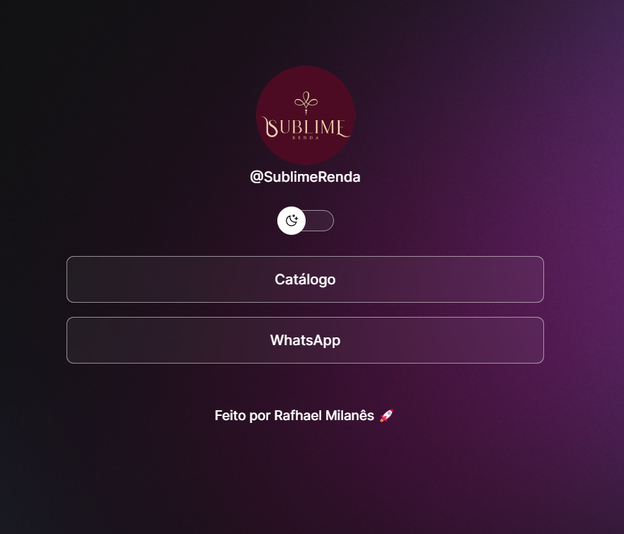

# Sublime Links

Projeto cuidadosamente planejado e desenvolvido para oferecer aos clientes uma experiência de compra online simplificada e agradável. Com uma interface intuitiva e organizada, esta página serve como um hub central para acesso rápido e fácil ao catalogo da loja e atendimento personalizado

## Screenshots

  

## 🚀 Tecnologias

Esse projeto foi desenvolvido com as seguintes tecnologias:

- HTML e CSS
- JavaScript
- Figma
- Git e Github

## 💻 Projeto

O Sublime Links é um agregador de links para usar como cartão de visitas online.

## Licença

Esse projeto está sob a licença MIT.

